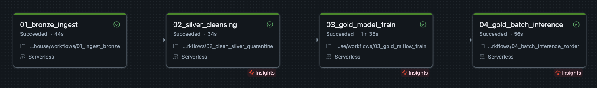
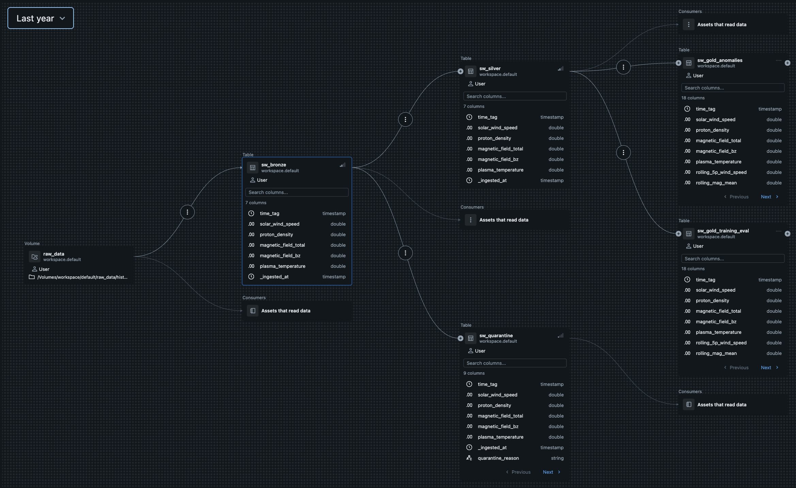
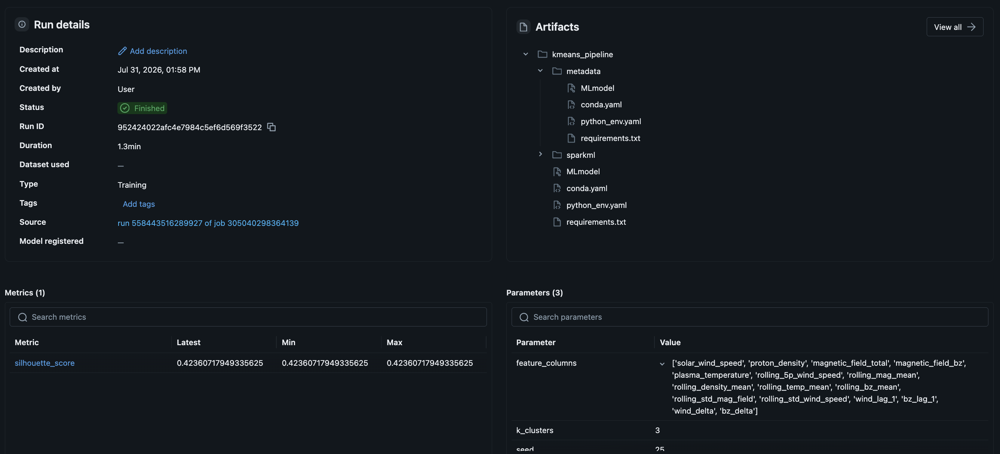

# Solar Wind Lakehouse & Anomaly Detection Pipeline

An end-to-end, enterprise-grade Data Engineering and MLOps Lakehouse platform built on Databricks and PySpark. This pipeline ingests raw space-weather telemetry, processes it through a Medallion Architecture (Bronze $\rightarrow$ Silver $\rightarrow$ Gold) with automated quarantine routing, engineers 16 time-series features, trains an unsupervised KMeans model tracked via MLflow, and executes batch inference optimized with Delta Z-Ordering.

**Tech Stack:** `Databricks (Serverless)` • `PySpark / Apache Spark` • `MLflow` • `Delta Lake` • `Unity Catalog` • `Python` • `SQL`


---

## Architecture

```text
                         Raw CSV Telemetry (UC Volume)
                                       │
                                       ▼
                              ┌─────────────────┐
                              │    sw_bronze    │  (Schema Enforcement & Ingestion Timestamps)
                              └────────┬────────┘
                                       │
                               Data Quality Gate
                               /               \
                          [Valid]             [Invalid]
                             │                    │
                             ▼                    ▼
                      ┌─────────────┐     ┌────────────────┐
                      │  sw_silver  │     │ sw_quarantine  │  (Isolated Data Quality Failures)
                      └──────┬──────┘     └────────────────┘
                             │
                  Feature Engineering (Window Functions, Lags, Deltas)
                             │
                             ├───► MLflow Training ───► Model Tracking
                             │
                             ▼
                      ┌───────────────────────────┐
                      │     sw_gold_anomalies     │  (Batch Predictions + Z-Ordered)
                      └───────────────────────────┘
```


## Workflow Orchestration & Data Lineage
1. Databricks Serverless Workflow (DAG)
Orchestrated as a 4-stage automated pipeline with explicit error handling, step timeout limits, and status logs:



2. Unity Catalog Lineage Graph
Unity Catalog automatically tracks full end-to-end governance and asset lineage, from raw volume files down to Gold prediction tables:



## Pipeline Stages Breakdown
### 1. Bronze Ingestion (`01_ingest_bronze.py`)
* **Source:** Historical solar wind telemetry (`historicsw.csv`) loaded from Unity Catalog Volumes.
* **Schema Enforcement:** Applies explicit typing (`TimestampType`, `DoubleType`) via PySpark `StructType` at read time.
* **Target Table:** `workspace.default.sw_bronze`

---

### 2. Silver Validation & Quarantine (`02_clean_silver_quarantine.py`)
* **Data Quality Gate:** Audits for missing primary keys (`time_tag`) and invalid telemetry (e.g., negative speeds, null metrics).
* **Quarantine Pattern:** Isolates failing records into `sw_quarantine` tagged with explicit `quarantine_reason` values.
* **Idempotent Merge:** Upserts validated records into `sw_silver` using Delta `MERGE INTO` matching on `time_tag`.

---

### 3. Gold Feature Engineering & ML Training (`03_gold_mlflow_train`)
* **Time-Series Features:** Calculates 16 metrics partitioned monthly (`DATE_TRUNC('month', time_tag)`):
  * **Rolling Means (5-period):** `rolling_5p_wind_speed`, `rolling_mag_mean`, `rolling_density_mean`, `rolling_temp_mean`, `rolling_bz_mean`
  * **Rolling Deviation:** `rolling_std_mag_field`, `rolling_std_wind_speed`
  * **Lag & Delta:** `wind_lag_1`, `bz_lag_1`, `wind_delta`, `bz_delta`
* **Pipeline Staging:** Bundles `VectorAssembler`, `StandardScaler`, and `KMeans(k=3)` into a single `PipelineModel`.
* **Target Table:** `workspace.default.sw_gold_training_eval`

---

### 4. Gold Batch Inference & Optimization (`04_batch_inference_zorder.py`)
* **Dynamic Fetching:** Programmatically loads the latest active model run directly from MLflow.
* **Performance Tuning:** Runs `OPTIMIZE sw_gold_anomalies ZORDER BY (time_tag)` to co-locate data for multi-dimensional filtering.
* **Time Travel Audit:** Verifies record count consistency across Delta versions using `DESCRIBE HISTORY`.

## MLOps & Experiment Tracking
Experiment lifecycle and model artifacts are managed through MLflow.
- Model Type: Unsupervised PySpark ML KMeans ($k=3$)
- Validation Metric: Silhouette Score ($\approx 0.4236$)
- Logged Artifacts: Model binary (sparkml/), configuration (MLmodel), environment specs (conda.yaml, requirements.txt), and feature metadata



## Repository Structure
```text
├── src/
│   ├── config.py                       # Unity Catalog paths, table names, and ML parameters
│   ├── schemas.py                      # Explicit PySpark StructTypes for Bronze ingestion & validation
├── workflows/
│   ├── 01_ingest_bronze.py             # Raw ingestion from UC Volume
│   ├── 02_clean_silver_quarantine.py   # Data validation & cleaning
│   ├── 03_gold_mlflow_train.py         # Feature engineering & MLflow training
│   └── 04_batch_inference_zorder.py    # Batch prediction & Delta optimization
├── images/                             # DAG, Lineage, and MLflow screenshots
└── README.md
```

## Quickstart
### Prerequisites
- Databricks Workspace with Unity Catalog enabled.

- Serverless Compute or Single-Node Cluster (DBR 13.3 LTS+ Recommended).

- Source dataset uploaded to /Volumes/workspace/default/raw_data/historicsw.csv.

### Execution
1. Clone the repository into your Databricks Workspace /Repos or User space.

2. Update paths in src/config.py if using custom catalog/schema names.

3. Run the orchestration notebook 05_orchestrate_pipeline.py to execute the pipeline end-to-end

*Developed by Shaan Patel*
